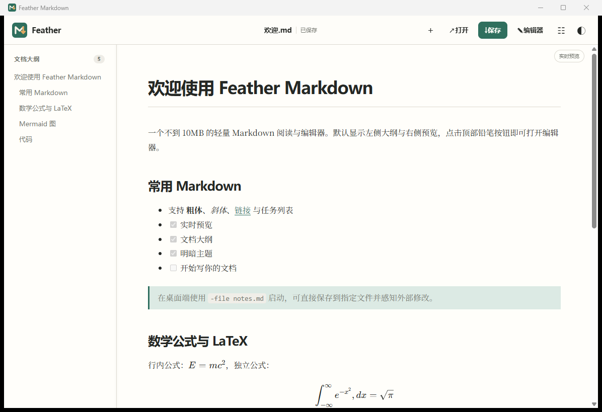

<div align="center">
  
  <h1>Feather Markdown</h1>
  <p><strong>轻量、阅读优先，需要时才出现编辑器的 Markdown 应用。</strong></p>
  <p>原生窗口 · 实时预览 · 文档大纲 · LaTeX · Mermaid</p>
  <p><a href="README.md">English</a> · <strong>简体中文</strong></p>
  <p>
    <a href="https://github.com/HaoqiWan/feather-markdown/releases/latest"></a>
    <a href="https://github.com/HaoqiWan/feather-markdown/actions/workflows/release.yml"></a>
    
    
  </p>
  <p>
    <a href="https://github.com/HaoqiWan/feather-markdown/releases/latest"><strong>下载最新版本</strong></a>
    · <a href="#从源码构建">从源码构建</a>
  </p>
</div>



Feather Markdown 从一个明确的约束出发：**每个 Release 文件必须小于 10 MiB**。它把界面嵌入轻量 Go 程序，并复用系统 WebView，而不是捆绑 Chromium。程序默认显示文档大纲和渲染结果，只有需要修改内容时才打开编辑器。

## 核心特点

| | |
| --- | --- |
| **阅读优先** | 默认显示大纲和预览，一次点击即可显示或隐藏编辑器。 |
| **实时渲染** | 约 140 ms 防抖刷新，编辑器与预览区域同步滚动。 |
| **丰富语法** | 支持 GFM 表格、任务列表、KaTeX 数学公式、LaTeX 分隔符和 Mermaid 图。 |
| **自适应布局** | 桌面端分隔线可拖动，格式工具栏自动换行，宽表格独立横向滚动。 |
| **真正的应用程序** | Windows 使用 WebView2，Apple 平台使用 WKWebView，Android 使用系统 WebView。 |
| **本地文件工作流** | 全平台支持打开与保存；桌面端还支持将本机文件夹作为分层笔记工作区。 |
| **完整导出** | 支持便携 Markdown、打印、PDF 与长图导出，本地图片使用标准相对路径。 |

此外还包含中英文切换、多套阅读风格、可定制快捷键、Mermaid 模板、自动文档大纲、完整格式工具栏、移动端响应式标签页、HTML 安全清理，以及全平台统一的羽毛应用图标。

> 桌面版提供工作区；Android 和 iOS 保持轻量的单文件模式，不显示工作区入口。

仓库同时提供独立的微信小程序版源码：默认展示预览，点击编辑后同一区域切换为编辑器，完成后返回预览。详见 [`wechat-miniprogram/`](wechat-miniprogram/)。

## 下载

每个版本固定包含十个文件——桌面与移动平台分别提供便携包或安装包。

| 平台 | 便携版 / 程序压缩包 | 安装包 | 说明 |
| --- | --- | --- | --- |
| Windows x64 | `windows-x64-portable.zip` | `windows-x64-setup.exe` | 使用系统已安装的 WebView2 Runtime。 |
| macOS Universal | `macos-universal-app.zip` | `macos-universal.dmg` | 同时包含 Intel 与 Apple Silicon 程序。 |
| Android | `android-app.zip` | `android.apk` | APK 使用项目固定发布密钥签名。 |
| Linux | `linux-x64.tar.gz` | `linux-arm64.tar.gz` | 需要系统 WebKit/WebView 运行库。 |
| iOS / iPadOS | `ios-app-unsigned.zip` | `ios-unsigned.ipa` | 安装前需要使用自己的 Apple 证书签名。 |

> [!NOTE]
> 当前 Windows 程序没有 Authenticode 签名，macOS 程序采用临时签名但未经过 Apple 公证，iOS 包未签名，因此系统可能显示安装警告。

## 快速开始

从 [GitHub Releases](https://github.com/HaoqiWan/feather-markdown/releases/latest) 下载对应平台的程序并启动即可。桌面版会直接显示独立应用窗口，没有浏览器地址栏，也不需要单独配置服务器。

桌面端打开、监听并直接保存指定文件：

```powershell
./FeatherMarkdown.exe -file README.md
```

```bash
./FeatherMarkdown -file README.md
```

<details>
<summary>命令行参数</summary>

```text
-addr string   内部监听地址（默认 127.0.0.1:0，自动选择空闲端口）
-browser       使用默认浏览器运行（仅用于调试或共享）
-debug         启用桌面 WebView 开发者工具
-file string   打开、监听并保存指定 Markdown 文件
-version       显示程序版本
```

</details>

## 快捷键

| 操作 | Windows / Linux | macOS |
| --- | --- | --- |
| 保存 | `Ctrl+S` | `⌘S` |
| 打开 | `Ctrl+O` | `⌘O` |
| 新建文档 | `Ctrl+N` | `⌘N` |
| 切换全屏 | `F11` | `F11` |
| 显示 / 隐藏编辑器 | `Ctrl+Shift+E` | `⌘⇧E` |
| 插入缩进 | `Tab` | `Tab` |

桌面端分隔线也支持方向键调整；按住 `Shift` 可增大步长，双击分隔线可恢复默认宽度。

## 从源码构建

桌面端需要 Go 1.24 或更新版本。构建脚本会先运行测试，再构建桌面目标、移除调试信息，并在任何程序超过 10 MiB 时直接失败。

```powershell
git clone https://github.com/HaoqiWan/feather-markdown.git
cd feather-markdown
go test ./...
./scripts/build.ps1 -Version dev
```

```bash
git clone https://github.com/HaoqiWan/feather-markdown.git
cd feather-markdown
go test ./...
./scripts/build.sh dev
```

移动端还需要：

- **Android：** JDK 17、Android SDK 35 和 Gradle 8.9。
- **iOS：** 安装了 Xcode 与 [XcodeGen](https://github.com/yonaskolb/XcodeGen) 的 macOS。

完整的五平台打包过程位于 [`.github/workflows/release.yml`](.github/workflows/release.yml)。

## 如何保持轻量

- Go 程序使用 `-trimpath` 和精简链接参数构建。
- 桌面程序复用操作系统提供的 WebView。
- Marked、DOMPurify、KaTeX 和 Mermaid 均锁定版本并从 CDN 加载，之后由 Service Worker 缓存。
- CDN 暂时不可用时，内置基础渲染器仍可显示普通内容。

第一次完整渲染数学公式和 Mermaid 图需要联网；普通文档内容与已经缓存的资源保留在本机。

## 技术结构

```text
Go 主程序
├─ 本地 HTTP 服务与文件同步
├─ 嵌入式响应式 Web 界面
└─ 桌面原生窗口
   ├─ Windows：WebView2
   ├─ macOS：WKWebView
   └─ Linux：系统 WebKit/WebView 后端

移动端外壳
├─ Android：Java + Android WebView
└─ iOS：Swift + WKWebView
```

主要目录：

| 路径 | 用途 |
| --- | --- |
| `main.go` | 本地服务、文件读写与程序生命周期 |
| `desktop_*.go` | 桌面原生窗口与平台集成 |
| `web/` | 阅读器、编辑器、主题、大纲、公式、Mermaid 与 PWA 资源 |
| `mobile/android/` | Android 原生应用 |
| `mobile/ios/` | iOS / iPadOS 原生应用 |
| `wechat-miniprogram/` | 微信小程序单文件阅读与编辑应用 |
| `packaging/` | Windows 安装器与 macOS App 资源 |
| `scripts/` | 可复现构建、图标生成和体积检查 |

## 安全与隐私

- 桌面端内部服务默认只监听 `127.0.0.1`。
- Markdown 生成的 HTML 使用 DOMPurify 清理。
- Mermaid 使用严格安全模式。
- 除非文档主动引用远程资源，否则文档内容只保存在当前设备。

## 参与贡献

欢迎提交问题、范围明确的 Pull Request 和不同平台的测试反馈。报告渲染问题时，请附上操作系统、程序版本及最小可复现 Markdown 示例。
